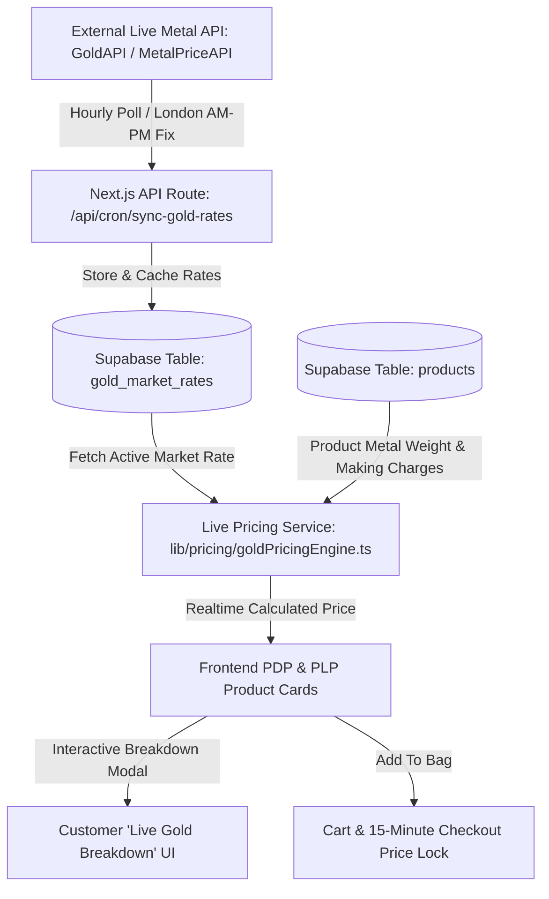

# BHAI Fine Jewellery — Dynamic UK Live Gold Market Pricing Engine
> **Document Version:** 1.0  
> **Target Implementation:** Scheduled Next Sprint / Tomorrow  
> **Target Market:** United Kingdom (LBMA Spot Rate in GBP £)

---

## 1. Executive Summary & Objective

This document outlines the complete architectural and mathematical specification for implementing a **Real-Time Live UK Gold Market Rate Pricing Engine** for the **BHAI Fine Jewellery** e-commerce store.

### The Objective:
Enable automated, market-linked price adjustments for solid gold and gold vermeil jewellery pieces based on live LBMA (London Bullion Market Association) gold spot rates in GBP (£), while maintaining transparency, fixed craftsmanship fees, gemstone valuations, and guaranteed profit margins.

---

## 2. Jewellery Pricing Formula & Mathematics

Gold jewellery pricing adheres to the standard fine jewellery valuation equation:

$$\mathbf{P_{\text{final}}} = \left[ \left( W_{\text{metal}} \times R_{\text{live/g}} \times F_{\text{karat}} \right) + C_{\text{craft}} + C_{\text{gem}} \right] \times (1 + M_{\text{margin}}) \times (1 + V_{\text{VAT}})$$

Where:
* **$W_{\text{metal}}$**: Metal Net Weight in Grams (e.g., $3.45\text{g}$).
* **$R_{\text{live/g}}$**: Live 24K Gold Spot Rate in GBP per Gram (e.g., $£68.20/\text{g}$).
* **$F_{\text{karat}}$**: Purity Multiplier of the precious metal (fraction of 24K).
* **$C_{\text{craft}}$**: Craftsmanship / Making charges (fixed design & bench work fee).
* **$C_{\text{gem}}$**: Gemstones / Diamonds valuation (if applicable).
* **$M_{\text{margin}}$**: Brand profit margin markup (e.g., $25\% = 0.25$).
* **$V_{\text{VAT}}$**: Standard UK Value Added Tax ($20\%$, if not included in base).

---

## 3. Karat Purity Multipliers ($F_{\text{karat}}$)

| Metal Specification | Hallmarking Stamp | Purity ($F_{\text{karat}}$) | Description |
| :--- | :---: | :---: | :--- |
| **24K Fine Gold** | 999 | `1.000` (100%) | Pure bullion gold (Investment standard) |
| **22K Crown Gold** | 916 | `0.916` (91.6%) | High purity traditional fine jewellery |
| **18K Solid Gold** | 750 | `0.750` (75.0%) | BHAI signature luxury solid gold |
| **14K Solid Gold** | 585 | `0.585` (58.5%) | Durable everyday solid gold |
| **9K Solid Gold** | 375 | `0.375` (37.5%) | Popular UK accessible solid gold |
| **18K Gold Vermeil** | 925 | Custom | Solid 925 Silver base weight + 2.5µm 18K gold coat |

---

## 4. System Architecture & Data Flow



---

## 5. Database Schema Requirements (Supabase)

### Table 1: `gold_market_rates`
Stores historic and active spot rates for caching to eliminate excessive API bills and optimize page load latency.

```sql
CREATE TABLE IF NOT EXISTS public.gold_market_rates (
    id UUID PRIMARY KEY DEFAULT gen_random_uuid(),
    metal VARCHAR(10) NOT NULL DEFAULT 'XAU', -- XAU = Gold, XAG = Silver
    currency VARCHAR(5) NOT NULL DEFAULT 'GBP',
    rate_per_gram_24k NUMERIC(10, 4) NOT NULL,
    rate_per_oz NUMERIC(12, 4) NOT NULL,
    source VARCHAR(50) DEFAULT 'LBMA_FEED',
    is_active BOOLEAN DEFAULT TRUE,
    created_at TIMESTAMPTZ DEFAULT NOW(),
    updated_at TIMESTAMPTZ DEFAULT NOW()
);
```

### Table 2: `products` Schema Enhancements
Add columns to allow dynamic metal calculation per product:

```sql
ALTER TABLE public.products
ADD COLUMN IF NOT EXISTS is_dynamic_gold_pricing BOOLEAN DEFAULT FALSE,
ADD COLUMN IF NOT EXISTS gold_weight_grams NUMERIC(8, 3) DEFAULT 0.000,
ADD COLUMN IF NOT EXISTS gold_karat VARCHAR(20) DEFAULT '18k',
ADD COLUMN IF NOT EXISTS making_charges_gbp NUMERIC(10, 2) DEFAULT 0.00,
ADD COLUMN IF NOT EXISTS gemstone_cost_gbp NUMERIC(10, 2) DEFAULT 0.00,
ADD COLUMN IF NOT EXISTS margin_percentage NUMERIC(5, 2) DEFAULT 25.00;
```

---

## 6. Live Rate Fetcher & Fallback Protection

### Primary & Fallback API Providers:
1. **GoldAPI.io** (Fast JSON responses in GBP per gram).
2. **MetalPriceAPI.com** (LBMA reliable real-time rates).
3. **Hardcoded Safety Fallback** (Guarantees the website never crashes or displays £0 if third-party APIs experience downtime).

### Rate Refresh Schedule:
* Synchronize during London Market trading hours (10:30 AM GMT & 3:00 PM GMT fixes, plus hourly updates).
* Cache validity: 60 minutes.

---

## 7. Frontend UI / UX Features to Build

### 1. "Live Gold Linked" Luxury Trust Badge
* Displayed on Product Detail Page (PDP) next to price.
* Glowing subtle green/gold pulse indicator: `● Live UK Gold Market Linked`.

### 2. Transparent Price Breakdown Modal / Tooltip
Customers can click a *"How is this priced?"* link to view exact transparency:
* **Gold Purity & Weight:** e.g., $18\text{K Gold} \times 4.20\text{g} = £214.83$
* **Artisan Craftsmanship & Finishing:** $£55.00$
* **Total Transparent Price:** $£269.83$

### 3. Cart & Checkout "Price Lock Timer" (15 Minutes)
* When a customer initiates checkout, lock the calculated price for **15 minutes** using a cryptographic session token.
* Prevents price fluctuation during active credit card entry.

---

## 8. Implementation Steps (Plan for Tomorrow)

| Step # | Task Component | Deliverables |
| :---: | :--- | :--- |
| **Phase 1** | **Database & SQL Setup** | Create `gold_market_rates` table and add dynamic pricing columns to `products`. |
| **Phase 2** | **Pricing Engine Utility** | Build `lib/pricing/goldEngine.ts` containing pure calculation formulas, purity maps, and fallback handlers. |
| **Phase 3** | **API Sync Endpoint** | Create `/api/cron/sync-gold-rates` with API key authentication and error fallbacks. |
| **Phase 4** | **Admin Panel Toggle** | Add dynamic gold weight, karat, and making charges inputs inside `AddProductView.tsx` & `ProductsView.tsx`. |
| **Phase 5** | **PDP & PLP UI Integration** | Connect real-time dynamic pricing to Product Detail Page, Product Cards, and Multi-Currency Converter. |
| **Phase 6** | **Checkout Price Lock** | Add 15-minute price preservation during checkout validation. |

---

## 9. Safety & Risk Controls

1. **Maximum Price Delta Cap:** If an external API reports a sudden glitch/anomaly ($\pm 15\%$ deviation in 1 hour), reject update and alert admin.
2. **Minimum Floor Price:** Products cannot sell below physical gold bullion melt value.
3. **Admin Manual Override:** Admin can toggle any product between `Fixed Static Price` and `Dynamic Gold Market Price` with one click.
