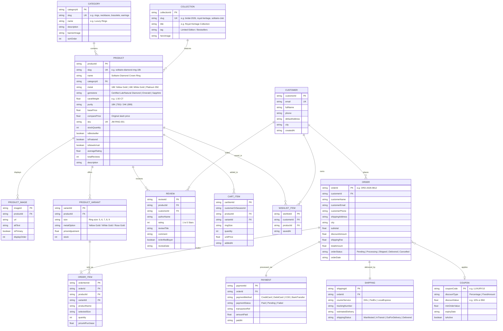

# 💎 Luxury Jewellery E-Commerce — ERP & Entity Relationship Model

> **Target Audience:** AI Agents & Software Engineers  
> **Unified ERP / ER Architecture Diagram**

---

## 1. Unified ERP & System Data Model

---

## 2. ERP Entity Index

| Entity | Purpose in Jewellery System |
| :--- | :--- |
| **`CATEGORY`** | Broad jewellery types (Rings, Necklaces, Bracelets, Earrings, Bridal). |
| **`COLLECTION`** | Curated seasonal themes (e.g., Royal Heritage, Solitaire Edition). |
| **`PRODUCT`** | Core jewellery item with metal purity, gemstone carat weight, and SKU. |
| **`PRODUCT_VARIANT`** | Size specifications (Ring sizes 5–9, Metal color choices). |
| **`PRODUCT_IMAGE`** | Multi-angle high-resolution visuals. |
| **`CUSTOMER`** | Registered user profile or guest checkout info. |
| **`CART_ITEM`** | Active session items in shopping bag. |
| **`WISHLIST_ITEM`** | Bookmarked pieces for later review. |
| **`ORDER` & `ORDER_ITEM`** | Complete order records with purchase price snapshot. |
| **`PAYMENT`** | Transaction tracking (Cards, COD, Transfer). |
| **`SHIPPING`** | Courier tracking and delivery status. |
| **`REVIEW`** | Verified buyer ratings and feedback. |
| **`COUPON`** | Promotional vouchers and discount codes. |
